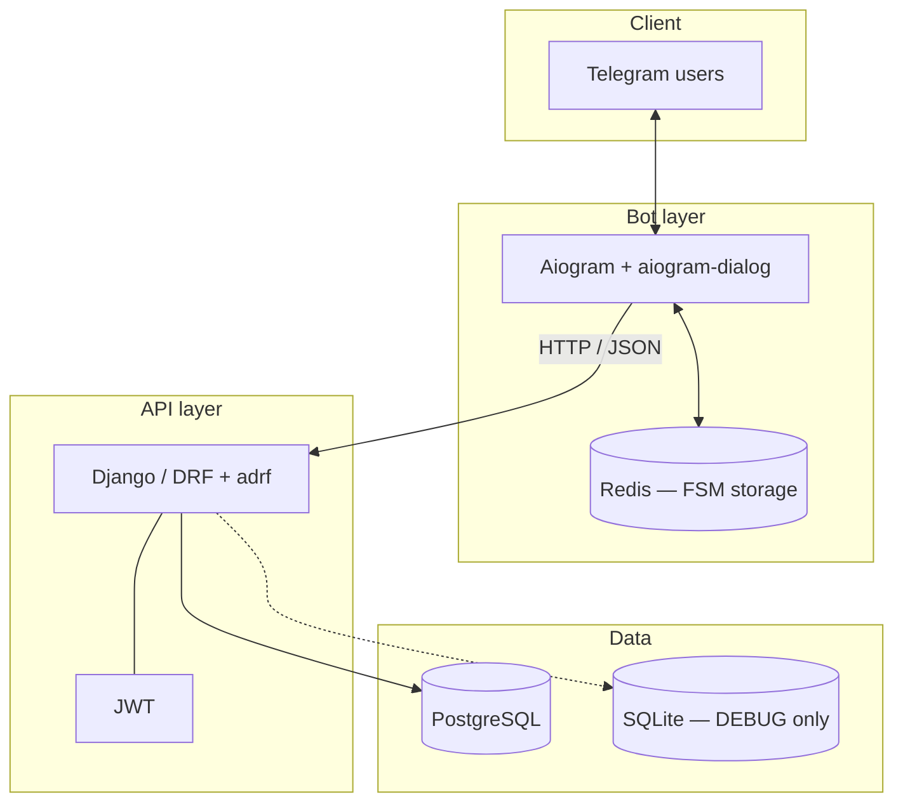

# ToDo

A full-stack task manager: a **Django REST API** backs a **Telegram bot** built with Aiogram. Users register (web or Telegram), authenticate with **JWT**, and manage tasks with categories, deadlines, and completion status.

## Features

- **Tasks**: create, list, update, delete; optional filtering and detail by id.
- **Categories**: urgency-based categories linked to tasks.
- **Auth**: Simple JWT (access/refresh, blacklist on rotation); separate registration flows for Telegram and web profiles.
- **Bot**: FSM dialogs via **Redis** storage; HTTP client to the API.
- **API docs**: OpenAPI schema and **Swagger UI** (drf-spectacular).

## Tech stack


| Layer        | Technologies                                                       |
| ------------ | ------------------------------------------------------------------ |
| API          | Django 6, Django REST Framework, async views (adrf), Daphne (ASGI) |
| Auth         | djangorestframework-simplejwt                                      |
| Database     | PostgreSQL (Docker / production-style); SQLite when `DEBUG=True`   |
| Bot          | Aiogram 3, aiogram-dialog, Redis (FSM)                             |
| Tooling      | uv, Ruff, pre-commit                                               |
| Optional ops | Docker Compose: Grafana, Loki, Promtail (logs/metrics plumbing)    |


## Application structure

### Architecture



### Repository tree

```text
.
├── backend/
│   ├── Dockerfile
│   ├── manage.py
│   ├── todo_manager/                 # Django project (settings, routing, ASGI)
│   │   ├── asgi.py
│   │   ├── config.py                 # env-driven settings (pydantic)
│   │   ├── settings.py
│   │   ├── urls.py                   # mounts /api/, /auth/, /admin/, /schema/
│   │   └── wsgi.py
│   ├── todo/                         # Tasks & categories
│   │   ├── migrations/
│   │   ├── serializers/
│   │   ├── models.py
│   │   ├── urls.py
│   │   ├── utils.py
│   │   └── views.py                  # async list/detail CRUD (adrf)
│   └── auth_user/                    # Registration & JWT-facing views
│       ├── migrations/
│       ├── admin.py
│       ├── models.py                 # TgProfile, WebProfile
│       ├── serializers.py
│       ├── urls.py
│       └── views.py
│
├── bot/
│   ├── Dockerfile
│   ├── main.py                       # Dispatcher, Redis storage, routers
│   ├── config.py
│   ├── api/
│   │   ├── client.py                 # aiohttp client + auth helpers
│   │   └── urls.py                   # backend path segments from env
│   ├── crud/                         # Thin wrappers over API (create/read/update/delete)
│   ├── dialogs/
│   │   ├── registration/             # Sign-up dialog (handlers, windows, states)
│   │   └── todo/                     # Task CRUD dialogs by feature folder
│   │       ├── create/
│   │       ├── read/
│   │       ├── update/
│   │       ├── delete/
│   │       ├── getters.py
│   │       └── router.py
│   └── register/
│
├── grafana/                          # Datasource provisioning (Compose)
├── docker-compose.yml
├── loki-config.yml
├── promtail-config.yml
├── pyproject.toml                    # uv dependency groups: backend, bot, dev
└── uv.lock
```

## Requirements

- **Python 3.13+**
- **[uv](https://docs.astral.sh/uv/)** (recommended) for installs and scripts
- **Docker** / Docker Compose for the full stack (Postgres, Redis, backend, bot, optional observability)

## Configuration

Create two env files at the **repository root** (they are gitignored; do not commit secrets):

### `.env.django`


| Variable                                            | Purpose                                                                     |
| --------------------------------------------------- | --------------------------------------------------------------------------- |
| `DJANGO_SECRET_KEY`                                 | Django secret                                                               |
| `DJANGO_DEBUG`                                      | `True` for local dev (uses SQLite); `False` uses Postgres settings below    |
| `POSTGRES_DB`, `POSTGRES_USER`, `POSTGRES_PASSWORD` | Postgres credentials                                                        |
| `POSTGRES_HOST`, `POSTGRES_PORT`                    | e.g. `pg` and `5432` in Compose; `127.0.0.1` when Postgres runs on the host |


### `.env.bot`


| Variable                               | Purpose                                                                                    |
| -------------------------------------- | ------------------------------------------------------------------------------------------ |
| `BOT_TOKEN`                            | Telegram bot token from [@BotFather](https://t.me/BotFather)                               |
| `REDIS_HOST`, `REDIS_PORT`, `REDIS_DB` | Redis for FSM (e.g. `redis`, `6379`, `0` in Compose)                                       |
| `BASE_URL`                             | API origin with trailing slash (e.g. `http://backend:8000/` in Docker)                     |
| `READ`, `CREATE`, `UPDATE`, `DELETE`   | Path segments under the API (default `api/list/`, `api/create/`, …)                        |
| `REGISTER`, `REFRESH`                  | Auth path segments (must match backend routes, e.g. `auth/tg/register/`, `token/refresh/`) |


Paths are concatenated with `BASE_URL`; keep trailing slashes consistent with the Django URLconf.

## Local development (without Docker)

1. Install dependencies:
  ```bash
   uv sync --group backend --group bot --group dev
  ```
2. Set `DJANGO_DEBUG=True` in `.env.django` and run migrations from `backend/`:
  ```bash
   cd backend && uv run python manage.py migrate
  ```
3. Start the API (from `backend/`):
  ```bash
   uv run python manage.py runserver
  ```
   Or ASGI with Daphne:
4. Start **Redis** locally (or via Docker only for Redis), then run the bot from the **repo root**:
  ```bash
   uv run python -m bot.main
  ```

## Docker Compose

From the repository root:

```bash
docker compose up --build
```

Typical ports:


| Service          | Port       | Notes                                                                       |
| ---------------- | ---------- | --------------------------------------------------------------------------- |
| Backend (Daphne) | 8000       | ASGI                                                                        |
| Postgres         | 5432       | Persisted volume `pgdata`                                                   |
| Redis            | (internal) | Bot dependency                                                              |
| Bot              | 8080       | Exposed in compose (adjust if unused)                                       |
| Grafana          | 3000       | Default admin user/password in `docker-compose.yml` (change for production) |
| Loki             | 3100       | Log aggregation                                                             |
| Promtail         | 9080       | Log shipping                                                                |


Ensure `.env.django` points `POSTGRES_HOST` to `pg` and `.env.bot` uses `REDIS_HOST=redis` and a `BASE_URL` reachable from the bot container (e.g. `http://backend:8000/`).

## API overview

Base URL prefix: `/api/` for tasks, `/auth/` for registration and tokens.


| Area  | Example paths                                                                                                                     |
| ----- | --------------------------------------------------------------------------------------------------------------------------------- |
| Tasks | `GET api/list/`, `GET api/list/<id>`, `POST api/create/`, `PUT/PATCH api/update/<id>`, `DELETE api/delete/<id>`                   |
| Auth  | `POST auth/tg/register/`, `POST auth/web/register/`, `POST auth/token/`, `POST auth/token/refresh/`, `POST auth/token/blacklist/` |


Interactive documentation:

- **OpenAPI schema**: `/schema/`
- **Swagger UI**: `/schema/swagger-ui/`

Django admin (Unfold theme): `/admin/`

CORS is preconfigured for Vite dev origins (`localhost:5173`); extend `CORS_ALLOWED_ORIGINS` in settings if your frontend uses another URL.

## Development tooling

- **Ruff**: `uv run ruff check` (see `pyproject.toml`)
- **pre-commit**: install hooks with `pre-commit install` and run `pre-commit run --all-files`
